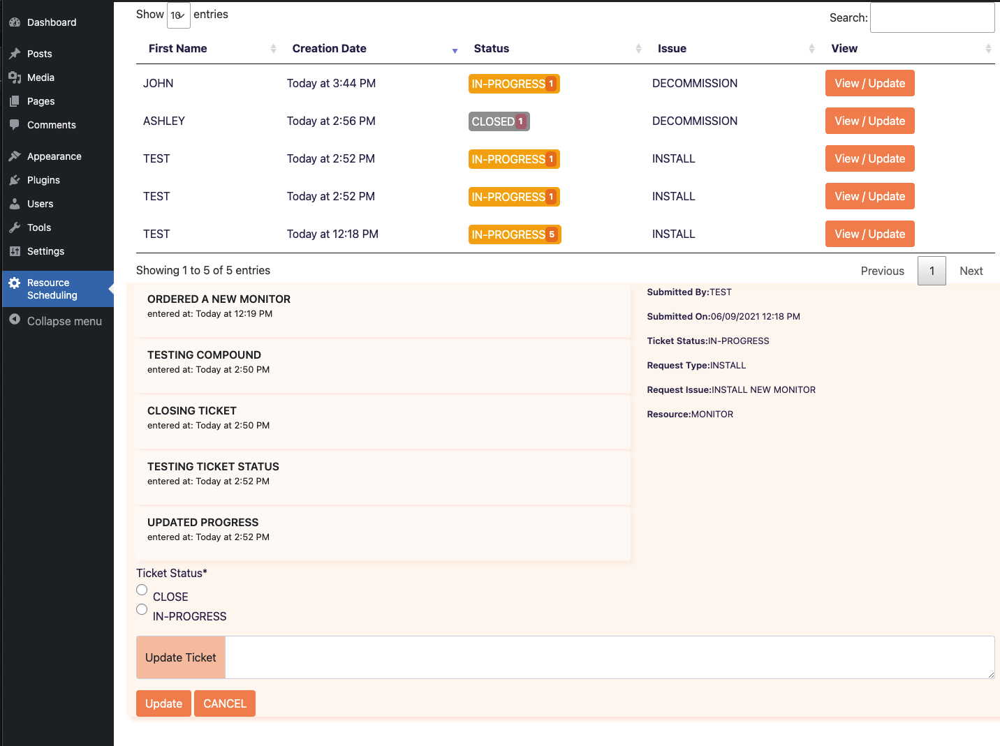
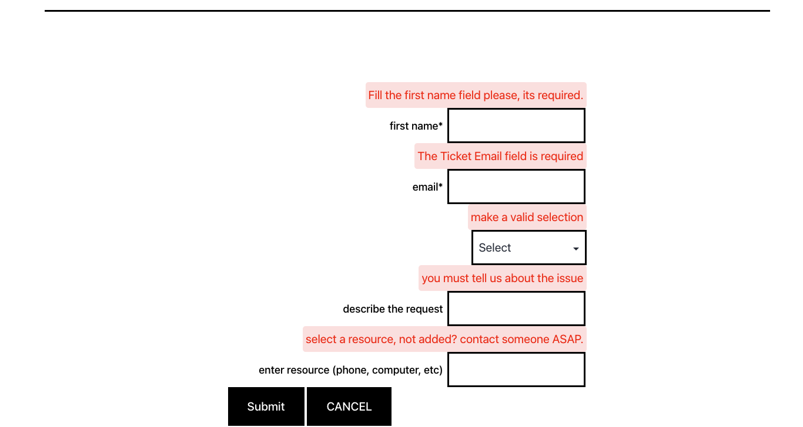

# WORDPRESS.ORG PLUGIN FOR BASIC TICKETING SYSTEM
This plugin contains a basic front-end slug with GUMP validation. Data appears on the backend admin menu under 'Resource Scheduling'. Admin is able to update the tickets internally, close the tickets, and filter using DataTables.

## CONFIGURATION
*   Utilizes PDO to make calls directly to SQL Database; does not utilize WPDB.
*   Requires Composer for GUMP validation utilization.
*   Utilizes a combination of JQuery, Bootstrap, and Moment.JS
*   Slug information is located within **Includes/class-resource-scheduling.php**. The shortcode is:
> [resource-scheduling]

## INSTALLATION
*   update the file host provider under: **includes/class-resource-scheduling-activator.php**
    *   Locate the **'127.0.0.1'** host information and replace it with your current host provider, or use **DB_HOST** if you are utilizing WP 5.7+
*   Update the **admin/class-resource-scheduling-admin.php** following the same steps as above (located within the DBh Class).
*   Update the **public/class-resource-scheduling-public.php** following the same steps as above (located within the PDB class)

## WORDPRESS INFORMATION
*   utilizes version 5.7.2
*   

## CREDITS :octocat:
*   __Wixel/GUMP__: form validation.
*   __JQuery__: Multiple uses and looping of data.
*   __Moment.js__: Used to convert timestamp into readable format.
*   __Bootstrap__: Version 5.0.1. Not downloaded (located within Admin/class-resource-scheduling-admin.php & public file)
*   __Datatables__: Version 1.10.24. Not downloaded (located as stated above; not in public file)
*   __WPPB.ME__: WORDPRESS Plugin Biolerplate Generator [wppb.me](https://wppb.me/)
